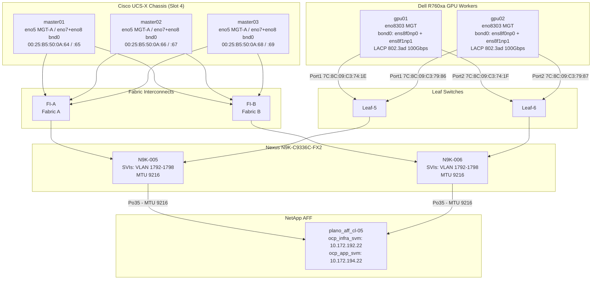
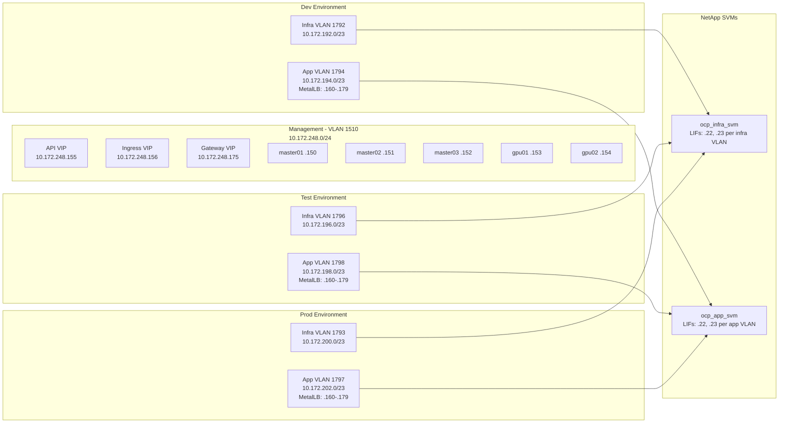
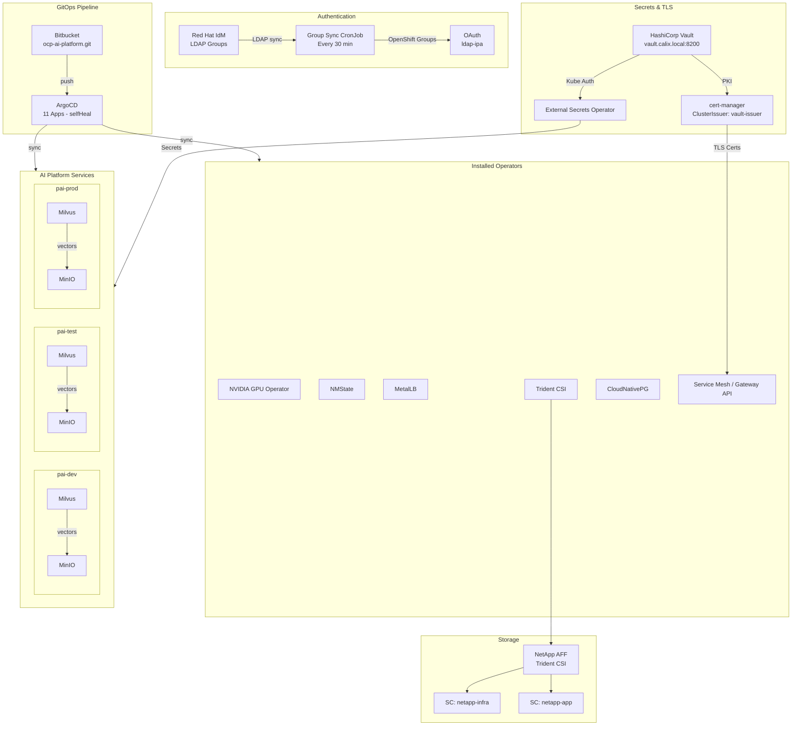
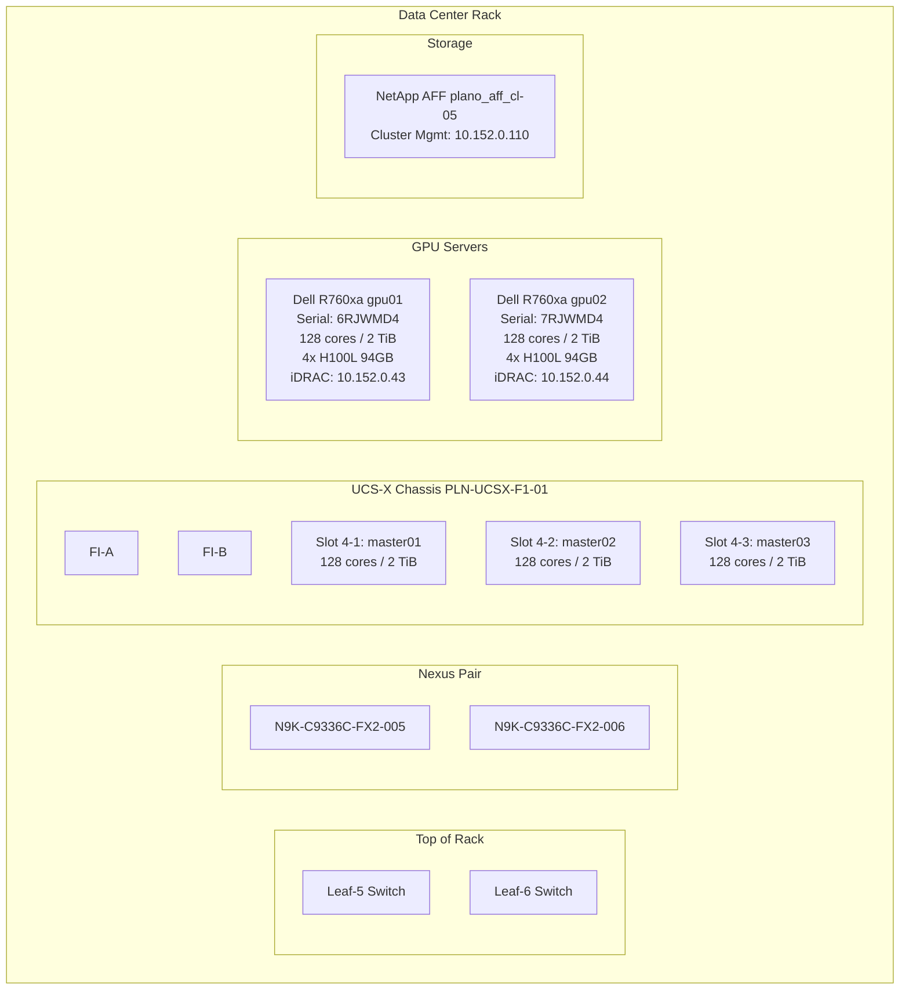

# OCP-AI Platform — Architecture Document

**Calix — Engineering Operations**
**OpenShift 4.20.13 | Bare Metal | AI/ML Workloads**
**Version 2.3**
**Classification: Internal — Calix**

---

## 1. Platform Overview

The OCP-AI platform is a production bare-metal OpenShift 4.20.13 cluster purpose-built for AI/ML workloads. It provides GPU-accelerated compute (8x NVIDIA H100L 94GB), enterprise networking with environment isolation, NetApp-backed persistent storage, and a GitOps-managed deployment pipeline. The platform supports model training, inference serving, vector search, and data processing workloads.

| Parameter | Value |
|---|---|
| Cluster Name | ocp-ai |
| Base Domain | calix.local |
| OpenShift Version | 4.20.13 (Kubernetes v1.33.6) |
| Network Plugin | OVNKubernetes |
| Install Method | Red Hat Assisted Installer |
| Total CPU | 640 cores (384 control plane + 256 GPU workers) |
| Total Memory | ~9.9 TiB |
| Total GPU | 8x NVIDIA H100L 94GB (752 GB GPU memory) |
| Total Nodes | 5 (3 control plane + 2 GPU workers) |
| License | Red Hat subscription — active |
| Cluster ID | a755e1fd-ea30-48c8-ae58-28e16e760bae |

---

## 2. Architecture Diagrams

### 2.1 End-to-End Physical Topology

### 2.2 Network Architecture

### 2.3 Platform Services and Data Flow

### 2.4 Physical Rack Layout

### 2.5 Complete Platform Architecture

```mermaid
graph TB
    subgraph External["External Access"]
        USER["Users / Browsers"]
        CLI["oc CLI"]
    end

    subgraph Ingress["Ingress Layer"]
        ROUTER["Platform Router<br/>*.apps.ocp-ai.calix.local<br/>VIP: 10.172.248.156"]
        GWAPI["Gateway API (Istio/Envoy)<br/>*.dev/test/prod.ocp-ai.calix.local<br/>VIP: 10.172.248.175"]
        MLB["MetalLB L2<br/>TCP LoadBalancers<br/>Per-env VLANs"]
    end

    subgraph Console["Platform UIs"]
        OCP_CON["OpenShift Console"]
        ARGO_UI["ArgoCD"]
        VAULT_UI["Vault UI"]
    end

    subgraph GitOps["GitOps — ArgoCD (11 Apps)"]
        BB["Bitbucket<br/>ocp-ai-platform.git"]
        ARGO["ArgoCD Controller<br/>selfHeal + prune"]
    end

    subgraph Auth["Authentication & RBAC"]
        IDM["Red Hat IdM<br/>LDAP Groups: engops, mlops"]
        SYNC["Group Sync CronJob<br/>Every 30 min"]
        OAUTH["OAuth Provider<br/>ldap-ipa"]
        RBAC_DEV["pai-dev: mlops=admin"]
        RBAC_TEST["pai-test: mlops=edit"]
        RBAC_PROD["pai-prod: mlops=view"]
    end

    subgraph Secrets["Secrets & TLS"]
        VAULT["HashiCorp Vault<br/>vault.calix.local:8200<br/>KV v2 + PKI"]
        ESO["External Secrets Operator<br/>5 SecretStores"]
        CERTMGR["cert-manager<br/>ClusterIssuer: vault-issuer<br/>Auto-renew 30d before expiry"]
    end

    subgraph Compute["Compute Nodes"]
        subgraph Masters["Control Plane (3x UCS-X)"]
            M1["master01<br/>128c / 2TiB<br/>bnd0: eno7+eno8"]
            M2["master02<br/>128c / 2TiB<br/>bnd0: eno7+eno8"]
            M3["master03<br/>128c / 2TiB<br/>bnd0: eno7+eno8"]
        end
        subgraph Workers["GPU Workers (2x R760xa)"]
            G1["gpu01<br/>128c / 2TiB / 4x H100L<br/>bond0: LACP 100Gbps"]
            G2["gpu02<br/>128c / 2TiB / 4x H100L<br/>bond0: LACP 100Gbps"]
        end
    end

    subgraph Network["Network Layer"]
        OVN["OVNKubernetes CNI<br/>Pod + Service Network"]
        NMSTATE["NMState Operator<br/>Bonds, VLANs, MTU 9000"]
        NETPOL["NetworkPolicies<br/>Environment Isolation"]
    end

    subgraph Platform["Platform Services (per environment)"]
        subgraph DEV["pai-dev (VLAN 1794)"]
            MINIO_D["MinIO<br/>S3 API :9000<br/>LB: .160"]
            MILVUS_D["Milvus<br/>gRPC :19530<br/>LB: .161"]
            TRITON_D["Triton Server<br/>HTTP :8000<br/>(app-deployed)"]
            PG_D["PostgreSQL<br/>(CNPG Cluster CR)<br/>(app-deployed)"]
        end
        subgraph TEST["pai-test (VLAN 1798)"]
            MINIO_T["MinIO<br/>S3 API :9000<br/>LB: .160"]
            MILVUS_T["Milvus<br/>gRPC :19530<br/>LB: .161"]
        end
        subgraph PROD["pai-prod (VLAN 1797)"]
            MINIO_P["MinIO<br/>S3 API :9000<br/>LB: .160"]
            MILVUS_P["Milvus<br/>gRPC :19530<br/>LB: .161"]
        end
    end

    subgraph Storage["Storage Layer"]
        TRIDENT["Trident CSI"]
        subgraph NetApp["NetApp AFF"]
            INFRA_SVM["ocp_infra_svm<br/>LIFs on VLANs 1792/1796/1793"]
            APP_SVM["ocp_app_svm<br/>LIFs on VLANs 1794/1798/1797"]
        end
        SC_INFRA["SC: netapp-infra<br/>Registry, Logging"]
        SC_APP["SC: netapp-app (default)<br/>MinIO, Milvus, App PVCs"]
    end

    subgraph Operators["Installed Operators"]
        GPU_OP["NVIDIA GPU Operator<br/>+ NFD"]
        CNPG_OP["CloudNativePG<br/>v1.28.1"]
        MCO["Machine Config Operator<br/>NTP, MTU, SSH, Policy Routes"]
    end

    %% External access flows
    USER -->|"HTTPS"| ROUTER
    USER -->|"HTTPS"| GWAPI
    CLI -->|"API :6443"| M1

    %% Router serves platform UIs
    ROUTER --> OCP_CON
    ROUTER --> ARGO_UI
    ROUTER --> VAULT_UI

    %% Gateway serves app routes
    GWAPI -->|"HTTPRoutes"| DEV
    GWAPI -->|"HTTPRoutes"| TEST
    GWAPI -->|"HTTPRoutes"| PROD

    %% MetalLB serves TCP
    MLB -->|"TCP LB"| MINIO_D
    MLB -->|"TCP LB"| MILVUS_D
    MLB -->|"TCP LB"| MINIO_T
    MLB -->|"TCP LB"| MILVUS_T
    MLB -->|"TCP LB"| MINIO_P
    MLB -->|"TCP LB"| MILVUS_P

    %% GitOps
    BB -->|"push"| ARGO
    ARGO -->|"sync"| Platform
    ARGO -->|"sync"| Network
    ARGO -->|"sync"| Auth

    %% Auth chain
    IDM --> SYNC
    SYNC --> OAUTH
    OAUTH --> RBAC_DEV
    OAUTH --> RBAC_TEST
    OAUTH --> RBAC_PROD

    %% Secrets chain
    VAULT -->|"Kube Auth"| ESO
    ESO -->|"minio-credentials"| MINIO_D
    ESO -->|"minio-credentials"| MINIO_T
    ESO -->|"minio-credentials"| MINIO_P
    ESO -->|"trident secrets"| TRIDENT
    VAULT -->|"PKI sign"| CERTMGR
    CERTMGR -->|"TLS certs"| GWAPI

    %% Service data flows
    MILVUS_D -->|"vectors"| MINIO_D
    MILVUS_T -->|"vectors"| MINIO_T
    MILVUS_P -->|"vectors"| MINIO_P
    TRITON_D -->|"model files (S3)"| MINIO_D
    PG_D -->|"managed by"| CNPG_OP

    %% Storage
    TRIDENT --> INFRA_SVM
    TRIDENT --> APP_SVM
    INFRA_SVM --> SC_INFRA
    APP_SVM --> SC_APP
    SC_APP --> MINIO_D
    SC_APP --> MILVUS_D

    %% GPU
    GPU_OP --> G1
    GPU_OP --> G2

    %% Network
    NMSTATE --> Masters
    NMSTATE --> Workers
    NETPOL --> DEV
    NETPOL --> TEST
    NETPOL --> PROD
```

---

## 3. Physical Hardware

### 3.1 Control Plane — Cisco UCS-X Blades

Three Cisco UCS-X 210C-M7 blades in chassis PLN-UCSX-F1-01, Slot 4. Managed via Cisco Intersight with server profile template pln_srv_EO_UCS_M7.

| Blade | Hostname | IP | CPU | RAM | Disk |
|---|---|---|---|---|---|
| 4-1 | ocp-ai-master01.calix.local | 10.172.248.150 | 128 cores | 2 TiB | 480 GB |
| 4-2 | ocp-ai-master02.calix.local | 10.172.248.151 | 128 cores | 2 TiB | 480 GB |
| 4-3 | ocp-ai-master03.calix.local | 10.172.248.152 | 128 cores | 2 TiB | 480 GB |

vNIC layout — Fabric failover is OFF. OS-level bonding handles redundancy for storage traffic.

| vNIC | Interface | Purpose | Fabric |
|---|---|---|---|
| OCP-MGT-A | eno5 | Management (br-ex) | A |
| OCP-MGT-B | eno6 | Disabled (ARP conflict fix — MachineConfig 99-master-eno6-down) | B |

**Note on eno6:** Disabling eno6 removes management NIC redundancy on the control plane nodes. If Fabric A fails, masters lose management connectivity. Storage redundancy is unaffected (bnd0 = eno7 + eno8 spans both fabrics). This was a temporary fix to prevent eno6 from responding to ARP for MetalLB VIPs on br-ex. A better approach that preserves management redundancy while preventing the ARP conflict needs to be revisited.
| OCP-DATA-A | eno7 | Storage (bnd0 primary) | A |
| OCP-DATA-B | eno8 | Storage (bnd0 standby) | B |

### 3.2 MAC Addresses — Control Plane

| Blade | MGT (eno5) | DATA (eno7) |
|---|---|---|
| 4-1 (master01) | 00:25:B5:50:0A:64 | 00:25:B5:50:0A:65 |
| 4-2 (master02) | 00:25:B5:50:0A:66 | 00:25:B5:50:0A:67 |
| 4-3 (master03) | 00:25:B5:50:0A:68 | 00:25:B5:50:0A:69 |

### 3.3 GPU Workers — Dell PowerEdge R760xa

Two Dell R760xa servers with 4x NVIDIA H100L GPUs each. Running on 100Gbps Mellanox ConnectX-7 LACP bond (bond0) with storage VLANs 1792-1798 and app VLANs for MetalLB.

| Parameter | GPU01 | GPU02 |
|---|---|---|
| Serial | 6RJWMD4 | 7RJWMD4 |
| CPU | 2x Xeon Plat 8562Y+ (128 HT cores) | Same |
| RAM | 2 TiB | 2 TiB |
| GPU | 4x H100L 94GB | 4x H100L 94GB |
| Boot | 480 GB NVMe (BOSS-N1) | Same |
| Local Storage | 26.88 TB RAID | Same |
| iDRAC | 10.152.0.43 | 10.152.0.44 |
| Mgmt NIC (eno8303) | C8:4B:D6:F3:D8:40 | C8:4B:D6:F3:D8:22 |
| Mellanox Port 1 | 7C:8C:09:C3:74:1E | 7C:8C:09:C3:79:86 |
| Mellanox Port 2 | 7C:8C:09:C3:74:1F | 7C:8C:09:C3:79:87 |
| Port 1 Switch | a0:bc:6f:d9:72:fc Eth1/12 | 48:80:02:e3:bd:98 Eth1/13 |
| Port 2 Switch | 48:80:02:e3:bd:94 Eth1/12 | a0:bc:6f:d9:73:00 Eth1/13 |

Each Mellanox port connects to a different leaf switch for physical redundancy. LACP bond (bond0) operational with storage and app VLANs configured.

---

## 4. Network Architecture

### 4.1 Management Network — VLAN 1510

| Parameter | Value |
|---|---|
| VLAN ID | 1510 (native/untagged) |
| Subnet | 10.172.248.0/24 |
| Gateway | 10.172.248.1 |
| DNS | 10.172.248.31, 10.172.248.32 |
| NTP | time1.calix.local (10.168.21.1), time2.calix.local (10.168.21.2) |
| MTU | 9000 (jumbo frames) |

### 4.2 DNS Records

| Record | IP |
|---|---|
| api.ocp-ai.calix.local | 10.172.248.155 (API VIP) |
| *.apps.ocp-ai.calix.local | 10.172.248.156 (Platform ingress) |
| *.dev.ocp-ai.calix.local | 10.172.248.175 (Gateway API) |
| *.test.ocp-ai.calix.local | 10.172.248.175 (Gateway API) |
| *.prod.ocp-ai.calix.local | 10.172.248.175 (Gateway API) |

### 4.3 Node IP Assignments

| Hostname | IP | Role |
|---|---|---|
| ocp-ai-master01.calix.local | 10.172.248.150 | Control Plane + Worker |
| ocp-ai-master02.calix.local | 10.172.248.151 | Control Plane + Worker |
| ocp-ai-master03.calix.local | 10.172.248.152 | Control Plane + Worker |
| ocp-ai-gpu01.calix.local | 10.172.248.153 | GPU Worker |
| ocp-ai-gpu02.calix.local | 10.172.248.154 | GPU Worker |
| api.ocp-ai.calix.local | 10.172.248.155 | API VIP |
| *.apps.ocp-ai.calix.local | 10.172.248.156 | Ingress VIP |

### 4.4 Storage VLANs

Six dedicated storage VLANs for dev/test/prod isolation. Configured on master nodes via NMState bond (bnd0 = eno7 + eno8 active-backup, MTU 9000).

| Env | Type | VLAN | Subnet | NetApp LIF IPs | Gateway |
|---|---|---|---|---|---|
| Dev | Infra | 1792 | 10.172.192.0/23 | 10.172.192.22, .23 | — (L2 only) |
| Dev | App | 1794 | 10.172.194.0/23 | 10.172.194.22, .23 | 10.172.194.1 |
| Test | Infra | 1796 | 10.172.196.0/23 | 10.172.196.22, .23 | — (L2 only) |
| Test | App | 1798 | 10.172.198.0/23 | 10.172.198.22, .23 | 10.172.198.1 |
| Prod | Infra | 1793 | 10.172.200.0/23 | 10.172.200.22, .23 | — (L2 only) |
| Prod | App | 1797 | 10.172.202.0/23 | 10.172.202.22, .23 | 10.172.202.1 |

### 4.5 Master Node Storage IPs

| VLAN | Master01 | Master02 | Master03 |
|---|---|---|---|
| 1792 | 10.172.192.150 | 10.172.192.151 | 10.172.192.152 |
| 1794 | 10.172.194.150 | 10.172.194.151 | 10.172.194.152 |
| 1796 | 10.172.196.150 | 10.172.196.151 | 10.172.196.152 |
| 1798 | 10.172.198.150 | 10.172.198.151 | 10.172.198.152 |
| 1793 | 10.172.200.150 | 10.172.200.151 | 10.172.200.152 |
| 1797 | 10.172.202.150 | 10.172.202.151 | 10.172.202.152 |

---

## 5. Storage Architecture

### 5.1 NetApp AFF Cluster

| Parameter | Value |
|---|---|
| Cluster Name | plano_aff_cl |
| Cluster Mgmt IP | 10.152.0.110 |
| Nodes | 6 (plano_aff_cl-01 through 06) |
| Type | AFF (All Flash) |

### 5.2 Storage Virtual Machines

| SVM | Purpose | Mgmt LIF | Aggregates | Credentials |
|---|---|---|---|---|
| ocp_infra_svm | Infrastructure | 10.172.254.46 | aggr1_n1 through n6 | vsadmin (CyberArk) |
| ocp_app_svm | Application | 10.172.254.47 | aggr1_n1 through n6 | vsadmin (CyberArk) |

SVM credentials are managed in CyberArk. Trident backend credentials are synced from Vault via ESO.

### 5.3 Trident CSI Backends

| Backend | SVM | Data LIF | Mgmt LIF | StorageClass |
|---|---|---|---|---|
| backend-infra-nfs | ocp_infra_svm | 10.172.192.22 | 10.172.254.46 | netapp-infra |
| backend-app-nfs | ocp_app_svm | 10.172.194.22 | 10.172.254.47 | netapp-app (default) |

### 5.4 NFS Export Policies

| SVM | Policy | Allowed Clients |
|---|---|---|
| ocp_infra_svm | backend_infra_access | 10.172.192.0/24, .196.0/24, .200.0/24, .248.0/24 |
| ocp_app_svm | backend_app_access | 10.172.194.0/24, .198.0/24, .202.0/24, .248.0/24 |

---

## 6. Platform Services

### 6.1 GPU Compute

| Node | GPUs | Model | GPU Memory |
|---|---|---|---|
| ocp-ai-gpu01 | 4 | NVIDIA H100L 94GB | 376 GB |
| ocp-ai-gpu02 | 4 | NVIDIA H100L 94GB | 376 GB |
| **Total** | **8** | — | **752 GB** |

GPU Operator: gpu-operator-certified.v25.10.1. NFD + ClusterPolicy deployed. GPU workers tainted with `nvidia.com/gpu=true:NoSchedule` — pods must use `operator: Equal` with `value: "true"`, NOT `operator: Exists`.

GPU PCIe mapping (same both servers):

| GPU | Model | PCIe Address |
|---|---|---|
| 0 | H100L 94GB | 0000:4a:00.0 |
| 1 | H100L 94GB | 0000:61:00.0 |
| 2 | H100L 94GB | 0000:ca:00.0 |
| 3 | H100L 94GB | 0000:e1:00.0 |

### 6.2 Image Registry

| Parameter | Value |
|---|---|
| State | Managed, 2 replicas |
| Storage | 100Gi PVC (netapp-infra) |
| Scheduling | All nodes (GPU workers have storage access) |
| Route | default-route-openshift-image-registry.apps.ocp-ai.calix.local |
| Route Timeout | 600s |

### 6.3 GitOps — ArgoCD

| Parameter | Value |
|---|---|
| Operator | Red Hat OpenShift GitOps |
| Repository | git@bitbucket.org:calixprod/ocp-ai-platform.git |
| Auth | SSH deploy key (argocd-ocp-ai) |
| Pattern | App-of-Apps (selfHeal: true) |
| Branch | main |

All infrastructure changes must go through Git commits. selfHeal automatically reverts manual changes. 11 synced apps: metallb, gateway-api, machineconfigs, minio, milvus, trident, nmstate, eso, network-policies, authentication, ocp-ai-platform (root).

**Pending:** ArgoCD RBAC should be integrated with LDAP groups so the mlops team can view and sync their own apps without requiring cluster-admin credentials. Target: engops = ArgoCD admin, mlops = read-only on infra apps, sync access on application apps in dev only.

### 6.4 TLS / Vault PKI

| Parameter | Value |
|---|---|
| Vault Server | vault.calix.local:8200 (CNAME → plnx-vault) |
| Root PKI Engine | pki_root (self-signed, temporary) |
| Intermediate PKI Engine | pki_int |
| PKI Role | ocp-ai (*.calix.local, wildcards, 1yr max TTL, require_cn=false) |
| Vault Auth Path | kubernetes-ocp-ai |
| Service Account | vault-auth (cert-manager namespace) |
| ClusterIssuer | vault-issuer — Ready |

Two distinct trust chains: (1) Vault server TLS (corporate): vault.calix.local → CalixEntCA → CalixInterCA → CalixRootCA — used for HTTPS connections to Vault. ESO and cert-manager must trust this chain via caBundle. (2) Vault PKI engine (temporary): self-signed root → intermediate → leaf certs — signs cluster certificates. Will be swapped to Calix corporate CA once IT signs the intermediate CSR (requires Vault unseal keys).

### 6.5 Installed Operators

| Operator | Namespace | Status |
|---|---|---|
| Kubernetes NMState | openshift-nmstate | Succeeded |
| NetApp Trident Certified | trident | Installed |
| Node Feature Discovery (Red Hat) | openshift-nfd | Installed |
| NVIDIA GPU Operator | nvidia-gpu-operator | Installed |
| cert-manager Operator | cert-manager | Installed |
| Red Hat OpenShift GitOps | openshift-gitops | Installed |
| External Secrets Operator | external-secrets | Installed — SecretStores Ready |
| MetalLB Operator | metallb-system | Installed — L2 on App VLANs |
| Service Mesh (Istio/Envoy) | istio-system | Installed — Gateway API controller |
| CloudNativePG | openshift-operators | Installed (v1.28.1) — PostgreSQL operator |

### 6.6 MachineConfigs

| Name | Role | Purpose |
|---|---|---|
| 99-worker-mtu-9000 | worker | MTU 9000 on eno8303 + br-ex via systemd at boot |
| 99-master-chrony | master | NTP — time1/time2.calix.local |
| 99-worker-chrony | worker | NTP — time1/time2.calix.local |
| 99-worker-ssh | worker | SSH access |
| 99-worker-nm-dns-fix | worker | Fix NM DNS for OVN-K bare-metal reboot bug |
| 99-worker-app-vlan-policy-routes | worker | Policy routing for app VLANs 1794/1797/1798 |
| 99-master-app-vlan-policy-routes | master | Policy routing for app VLANs 1794/1797/1798 |
| 99-master-eno6-down | master | Disable eno6 standby NIC to prevent ARP conflicts with MetalLB VIPs |

### 6.7 Ingress and Load Balancing

Three ingress paths serve different purposes:

| Path | VIP / Range | Protocol | Use Case |
|---|---|---|---|
| Platform Router | 10.172.248.156 | HTTPS (*.apps) | Console, ArgoCD, OAuth |
| MetalLB (L2) | Per-env pools | TCP (any port) | PostgreSQL, MinIO, Milvus, Kafka |
| Gateway API | 10.172.248.175 | HTTPS (*.env.ocp-ai) | AI service web UIs, APIs |

#### MetalLB IP Pools

| Pool | IP Range | VLAN | Environment |
|---|---|---|---|
| pai-services-dev | 10.172.194.160-179 | 1794 | pai-dev |
| pai-services-test | 10.172.198.160-179 | 1798 | pai-test |
| pai-services-prod | 10.172.202.160-179 | 1797 | pai-prod |
| reserved-future | 10.172.248.175-180 | 1510 | Gateway VIP + reserved |

#### Current IP Allocations

| Service | pai-dev | pai-test | pai-prod |
|---|---|---|---|
| MinIO | 10.172.194.160 | 10.172.198.160 | 10.172.202.160 |
| Milvus | 10.172.194.161 | 10.172.198.161 | 10.172.202.161 |
| Kafka (reserved) | 10.172.194.162 | 10.172.198.162 | 10.172.202.162 |

#### Gateway API

Single gateway (pai-gateway) in openshift-ingress namespace. VIP 10.172.248.175. Four listeners:

| Listener | Port | Hostname | Purpose |
|---|---|---|---|
| http | 80 | all | 301 redirect to HTTPS |
| https-dev | 443 | *.dev.ocp-ai.calix.local | Dev services |
| https-test | 443 | *.test.ocp-ai.calix.local | Test services |
| https-prod | 443 | *.prod.ocp-ai.calix.local | Prod services |

TLS: Wildcard certificates issued by cert-manager via Vault PKI (pki_int/sign/ocp-ai). One-year duration, auto-renewed 30 days before expiry. DNS: *.dev/test/prod.ocp-ai.calix.local all resolve to 10.172.248.175.

### 6.8 AI Platform Services

The following shared services are deployed and managed by the infrastructure team for use by the AI/ML workloads.

#### 6.8.1 MinIO (S3-Compatible Object Storage)

| | pai-dev | pai-test | pai-prod |
|---|---|---|---|
| Status | Running | Running | Running |
| Image | minio/minio:RELEASE.2025-02-28T09-55-16Z | same | same |
| Mode | Standalone | Standalone | Standalone |
| Storage | 100Gi PVC (netapp-app) | 100Gi | 200Gi |
| S3 API (internal) | minio.pai-dev.svc:9000 | minio.pai-test.svc:9000 | minio.pai-prod.svc:9000 |
| S3 API (external) | 10.172.194.160:9000 | 10.172.198.160:9000 | 10.172.202.160:9000 |
| Console URL | https://minio.dev.ocp-ai.calix.local | https://minio.test.ocp-ai.calix.local | https://minio.prod.ocp-ai.calix.local |
| Credentials | minio-credentials secret (Vault/ESO) | same | same |
| ArgoCD | Managed (selfHeal + prune) | same | same |

**Pending:** MinIO should be integrated with LDAP so the mlops team can log into the MinIO console with their IPA credentials instead of shared root credentials. Target: LDAP-based access policies scoped per environment, with mlops having read/write in dev, read-only in prod.

#### 6.8.2 Milvus (Vector Database)

| | pai-dev | pai-test | pai-prod |
|---|---|---|---|
| Status | Running | Running | Running |
| Image | milvusdb/milvus:v2.6.11 | same | same |
| Mode | Standalone + embedded etcd | same | same |
| CPU / Memory | 4 CPU / 8Gi | 4 CPU / 8Gi | 8 CPU / 16Gi |
| Storage | 100Gi PVC + emptyDir (etcd) | 100Gi | 200Gi |
| gRPC (internal) | milvus.pai-dev.svc:19530 | milvus.pai-test.svc:19530 | milvus.pai-prod.svc:19530 |
| gRPC (external) | 10.172.194.161:19530 | 10.172.198.161:19530 | 10.172.202.161:19530 |
| Vector Storage | MinIO (milvus-bucket, rootPath: milvus/dev) | rootPath: milvus/test | rootPath: milvus/prod |
| Authentication | None (NetworkPolicies enforced) | same | same |

Architecture decisions: standalone mode with embedded etcd (external etcd requires block storage for flock, NFS does not support this). emptyDir overlay at /var/lib/milvus/etcd provides local disk for etcd metadata. Vector data persists in MinIO and survives pod rescheduling. All three environments managed via ArgoCD (selfHeal + prune).

#### 6.8.3 CloudNativePG (PostgreSQL Operator)

| Parameter | Value |
|---|---|
| Operator | CloudNativePG v1.28.1 (OperatorHub, certified-operators) |
| Namespace | openshift-operators (cluster-wide) |
| Status | Installed and validated |
| Ownership | Infra provides the operator. App teams deploy their own Cluster CRs. |
| Service Names | `<cluster>-rw` (primary), `<cluster>-ro` (replicas), `<cluster>-r` (any) |
| Credentials | Auto-generated in `<cluster>-app` secret. Not managed by Vault/ESO. |
| HA | Automatic failover tested — primary killed, replica promoted, data survived. |

See Onboarding Template G for deployment examples.

---

## 7. Access Information

### 7.1 Authentication

All authentication is through LDAP (Red Hat IdM). LDAP group sync runs every 30 minutes via CronJob in `ldap-group-sync` namespace, managed by ArgoCD.

| Property | Value |
|---|---|
| Identity Provider | ldap-ipa |
| IPA Server | cpeg-ipareplica.ipa.calix.local |
| Domain | ipa.calix.local |

### 7.2 RBAC — Tiered Access

| Group | Cluster Role | pai-dev | pai-test | pai-prod |
|---|---|---|---|---|
| engops | cluster-admin | full | full | full |
| mlops | — | admin | edit | view |

Production deployments go strictly through ArgoCD via PR review. Dev is open for active development.

### 7.3 Cluster Access

| Method | URL / Command |
|---|---|
| Web Console | https://console-openshift-console.apps.ocp-ai.calix.local |
| API | https://api.ocp-ai.calix.local:6443 |
| CLI Login (LDAP) | oc login -u <ipa-username> https://api.ocp-ai.calix.local:6443 --insecure-skip-tls-verify |
| SSH Masters | ssh -i ~/.ssh/ocp-ai core@10.172.248.150/151/152 (SSH key in CyberArk) |
| SSH GPU Workers | ssh -i ~/.ssh/ocp-ai core@10.172.248.153/154 |
| Registry | default-route-openshift-image-registry.apps.ocp-ai.calix.local |
| ArgoCD | openshift-gitops-server-openshift-gitops.apps.ocp-ai.calix.local |
| MinIO Console (dev) | https://minio.dev.ocp-ai.calix.local |
| MinIO Console (test) | https://minio.test.ocp-ai.calix.local |
| MinIO Console (prod) | https://minio.prod.ocp-ai.calix.local |

---

## 8. Vendor Documentation References

### OpenShift Platform

| Component | Documentation |
|---|---|
| OpenShift 4.20 | https://docs.openshift.com/container-platform/4.20/welcome/index.html |
| Assisted Installer | https://docs.openshift.com/container-platform/4.20/installing/installing_on_prem_assisted/installing-on-prem-assisted.html |
| OVNKubernetes CNI | https://docs.openshift.com/container-platform/4.20/networking/ovn_kubernetes_network_provider/about-ovn-kubernetes.html |
| MachineConfigs / MCO | https://docs.openshift.com/container-platform/4.20/post_installation_configuration/machine-configuration-tasks.html |
| OAuth / Identity Providers | https://docs.openshift.com/container-platform/4.20/authentication/understanding-identity-provider.html |
| LDAP Identity Provider | https://docs.openshift.com/container-platform/4.20/authentication/identity_providers/configuring-ldap-identity-provider.html |
| LDAP Group Sync | https://docs.openshift.com/container-platform/4.20/authentication/ldap-syncing.html |
| RBAC | https://docs.openshift.com/container-platform/4.20/authentication/using-rbac.html |
| NetworkPolicies | https://docs.openshift.com/container-platform/4.20/networking/network_policy/about-network-policy.html |
| Security Context Constraints | https://docs.openshift.com/container-platform/4.20/authentication/managing-security-context-constraints.html |

### Operators

| Component | Documentation |
|---|---|
| NMState Operator | https://docs.openshift.com/container-platform/4.20/networking/k8s_nmstate/k8s-nmstate-about-the-k8s-nmstate-operator.html |
| MetalLB Operator | https://docs.openshift.com/container-platform/4.20/networking/metallb/about-metallb.html |
| Gateway API | https://docs.openshift.com/container-platform/4.20/networking/ingress-operator.html#nw-ingress-gateway-api_configuring-ingress |
| NVIDIA GPU Operator | https://docs.nvidia.com/datacenter/cloud-native/gpu-operator/latest/openshift/contents.html |
| Node Feature Discovery | https://docs.openshift.com/container-platform/4.20/hardware_enablement/psap-node-feature-discovery-operator.html |
| cert-manager Operator | https://docs.openshift.com/container-platform/4.20/security/cert_manager_operator/index.html |
| OpenShift GitOps (ArgoCD) | https://docs.openshift.com/gitops/latest/understanding_openshift_gitops/about-redhat-openshift-gitops.html |
| CloudNativePG | https://cloudnative-pg.io/documentation/current/ |
| External Secrets Operator | https://external-secrets.io/latest/ |

### Storage

| Component | Documentation |
|---|---|
| NetApp Trident CSI | https://docs.netapp.com/us-en/trident/index.html |
| Trident on OpenShift | https://docs.netapp.com/us-en/trident/trident-use/openshift.html |
| Trident Backend Config | https://docs.netapp.com/us-en/trident/trident-use/backend-kubectl.html |
| ONTAP NFS Best Practices | https://docs.netapp.com/us-en/ontap/nfs-admin/index.html |

### Secrets and PKI

| Component | Documentation |
|---|---|
| HashiCorp Vault | https://developer.hashicorp.com/vault/docs |
| Vault Kubernetes Auth | https://developer.hashicorp.com/vault/docs/auth/kubernetes |
| Vault LDAP Auth | https://developer.hashicorp.com/vault/docs/auth/ldap |
| Vault PKI Engine | https://developer.hashicorp.com/vault/docs/secrets/pki |
| ESO Vault Provider | https://external-secrets.io/latest/provider/hashicorp-vault/ |
| cert-manager Vault Issuer | https://cert-manager.io/docs/configuration/vault/ |

### AI Platform Services

| Component | Documentation |
|---|---|
| MinIO | https://min.io/docs/minio/kubernetes/upstream/index.html |
| MinIO mc CLI | https://min.io/docs/minio/linux/reference/minio-mc.html |
| Milvus | https://milvus.io/docs |
| Milvus Standalone | https://milvus.io/docs/install_standalone-docker-compose.md |
| NVIDIA Triton Inference Server | https://docs.nvidia.com/deeplearning/triton-inference-server/user-guide/docs/index.html |
| Triton S3 Model Repository | https://docs.nvidia.com/deeplearning/triton-inference-server/user-guide/docs/user_guide/model_repository.html#s3 |

### Identity

| Component | Documentation |
|---|---|
| Red Hat IdM (FreeIPA) | https://docs.redhat.com/en/documentation/red_hat_enterprise_linux/9/html/installing_identity_management/index |
| Red Hat IdM LDAP | https://docs.redhat.com/en/documentation/red_hat_enterprise_linux/9/html/configuring_and_managing_identity_management/index |

